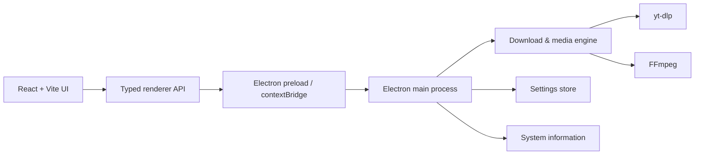

<div align="center">

# ⚡ AnyDL Pro Ultra

### Real Windows desktop media downloader powered by `yt-dlp` + `FFmpeg`


**A polished Electron desktop application with real metadata analysis, downloads, progress tracking, media processing and Windows packaging.**

</div>

---

## ✨ Why this project exists

AnyDL Pro Ultra began as a highly polished UI concept. This version connects that interface to a **real backend** instead of simulated data.

The application runs actual `yt-dlp` and `FFmpeg` processes, reads real metadata, parses live download progress and writes real files to the user's computer.

> The goal is simple: **never fake a feature just to make the UI look complete.**

---

## 🚀 Highlights

- **Real URL analysis** using `yt-dlp -J`
- **Live progress, speed and ETA** parsed from the download process
- **Pause / resume support** through `yt-dlp` partial files and continuation
- **Native Windows folder picker**
- **Persistent application settings** stored in the OS user-data directory
- **System telemetry** using `systeminformation`
- **Media processing tools** backed by real `FFmpeg` / `yt-dlp` flags
- **Bundled Windows binaries** for zero manual `yt-dlp` / `FFmpeg` setup after installation
- **Windows installer generation** using `electron-builder` + NSIS
- **GitHub Actions Windows build workflow**

---

## 🧠 Architecture



### Core layout

```text
electron/main.cjs       Electron lifecycle + IPC handlers
electron/engine.cjs     yt-dlp / FFmpeg process management
electron/preload.cjs    Safe contextBridge API
electron/store.cjs      Persistent settings storage
scripts/fetch-bin.cjs   Fetches official Windows binaries
src/lib/api.ts          Typed renderer-side API wrapper
src/                    React application UI
```

---

## 🔍 What's real

### Analyze
Runs `yt-dlp -J` against the supplied URL. Title, thumbnail, duration, uploader, subtitles and available formats come from the real source metadata.

### Download
Spawns a real `yt-dlp` child process with newline progress output and parses percentage, speed and ETA while downloading.

### Resume
Stopping a job leaves compatible `.part` files in place. Re-running the same job allows `yt-dlp` to continue where possible.

### System telemetry
CPU, RAM, disk, network and supported temperature information are collected through the `systeminformation` package.

### Settings
Settings persist to a JSON file inside Electron's OS user-data location. Folder selection uses the native Windows dialog and startup behavior uses Electron's login-item API.

### Media tools
Implemented tools map to real `yt-dlp` or `FFmpeg` behavior, including normalization, denoise, trim, chapter operations and multi-audio handling.

---

## 🧩 Deliberately not faked

Two advanced features are intentionally not presented as complete:

- **Automatic watermark removal** — reliable removal requires detection / localization logic, not a generic switch.
- **AI upscaling** — a proper implementation requires a bundled model and inference pipeline.

The browser-style **Universal Sniffer** uses real `yt-dlp` metadata analysis. It is not a packet-level browser network sniffer and it does not bypass DRM-protected media.

---

## 🛠️ Development

### Requirements

- Node.js 20+
- npm
- Windows is recommended for packaging the installer

### Start in development mode

```bash
npm install
npm run fetch-bin
npm run dev
```

The development app uses binaries in `resources/bin` when available, or supported system binaries where configured.

---

## 📦 Build the Windows installer

### Option A — GitHub Actions

The repository includes a Windows build workflow. Run it from the **Actions** tab or trigger it through the configured workflow event.

### Option B — local Windows build

```bash
npm install
npm run dist
```

Output is written to:

```text
release/AnyDL Pro Ultra-Setup-6.0.0.exe
```

The NSIS build creates a Windows x64 installer with Start Menu / desktop shortcut support and a configurable install location.

---

## 🧱 Technology

| Layer | Technology |
|---|---|
| UI | React 19 + TypeScript + Vite |
| Desktop shell | Electron |
| Download engine | yt-dlp |
| Media processing | FFmpeg |
| Motion / UI | Framer Motion |
| System data | systeminformation |
| Packaging | electron-builder + NSIS |
| Platform | Windows x64 |

---

## ⚠️ Responsible use

Use this application only for media you are legally permitted to download or process. Platform rules, copyright law and content licenses still apply.

---

<div align="center">

### Built as a real system, not a simulated demo.

**Poojana Kaveesh**

</div>
